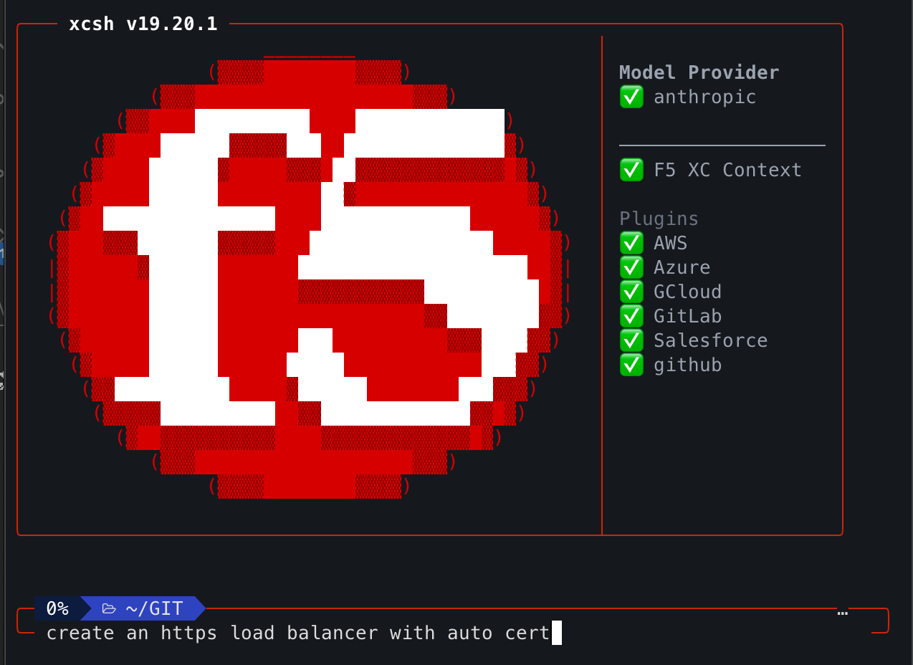

🌐 [English](README.md) | [日本語](README.ja.md) | [한국어](README.ko.md) |
[简体中文](README.zh-cn.md) | **繁體中文** | [Español](README.es.md) |
[Português](README.pt-br.md) | [Français](README.fr.md) |
[Deutsch](README.de.md) | [Italiano](README.it.md) | [العربية](README.ar.md) |
[हिन्दी](README.hi.md) | [ไทย](README.th.md)

# xcsh for VS Code

> 直接在 VS Code 中管理 F5 Distributed Cloud 資源

## 快速開始

1. **安裝擴充功能** — 在 VS Code 擴充功能面板中搜尋 "xcsh"
2. **安裝 xcsh** — `brew install f5xc-salesdemos/tap/xcsh`
3. **新增上下文** — 開啟命令面板（`Cmd+Shift+P`）並執行 **xcsh: Add Context**

## 功能概覽

- **瀏覽和管理資源** — 從側邊欄建立、編輯、刪除負載平衡器、WAF 策略、來源池等
- **AI 聊天助理** — 用自然語言向 `@xcsh` 提問來管理您的平台
- **雲端狀態儀表板** — 即時全球基礎設施健康狀態一覽
- **IntelliSense** — 所有 F5 XC 資源類型的 JSON Schema 自動補全
- **多雲端整合** — 支援 AWS、Azure、GCP、GitHub、GitLab、Terraform 和 Salesforce

## 文件

完整指南與參考文件請造訪
[f5xc-salesdemos.github.io/vscode-f5xc-tools/zh-tw/](https://f5xc-salesdemos.github.io/vscode-f5xc-tools/zh-tw/)

## 授權條款

[Apache-2.0](LICENSE)
